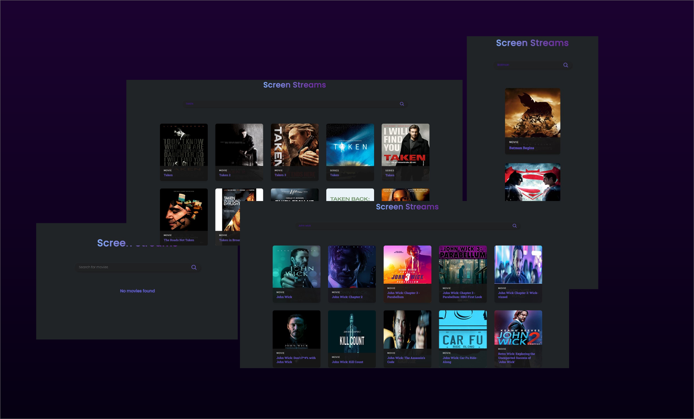

# Screen-Streams 🎥
```
React JS and Restful API based website the display all the movies and web series you search 
and JSON Server as a backend work handling.
```

<p>
  <b>
    ScreenStream is a software tool that allows users to share their computer screen with others in real-time. It enables remote collaboration and communication by allowing participants to view a user's desktop or specific application windows and allow user to search any web series and movies .
  </b>
</p>
<br>
<br>


```
Install dependencies:
npm install

Run React dev server (http://localhost:3000):
npm start
```
<br>

```
Restful API :
📎Link : http://www.omdbapi.com

Fill out the details and verify your mail Id,
The API Key and API ID will be sent on your respective mail
```

<br>

<div float="right" width="400">
  
</div>

<hr>
<br>

<div>
  <p>
  </p>
</div>


### Contact Details
```
Credits : Manu Mishra
Instagram : _mishramanu_
```

